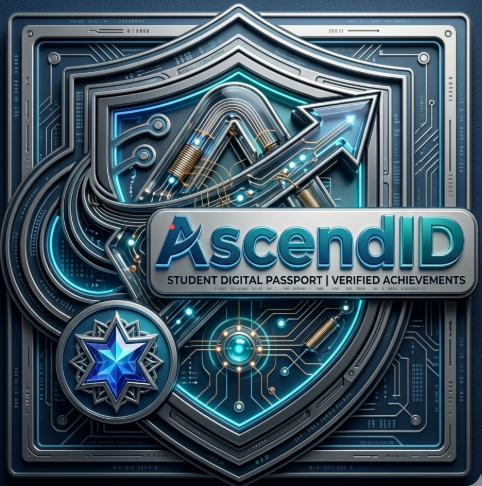
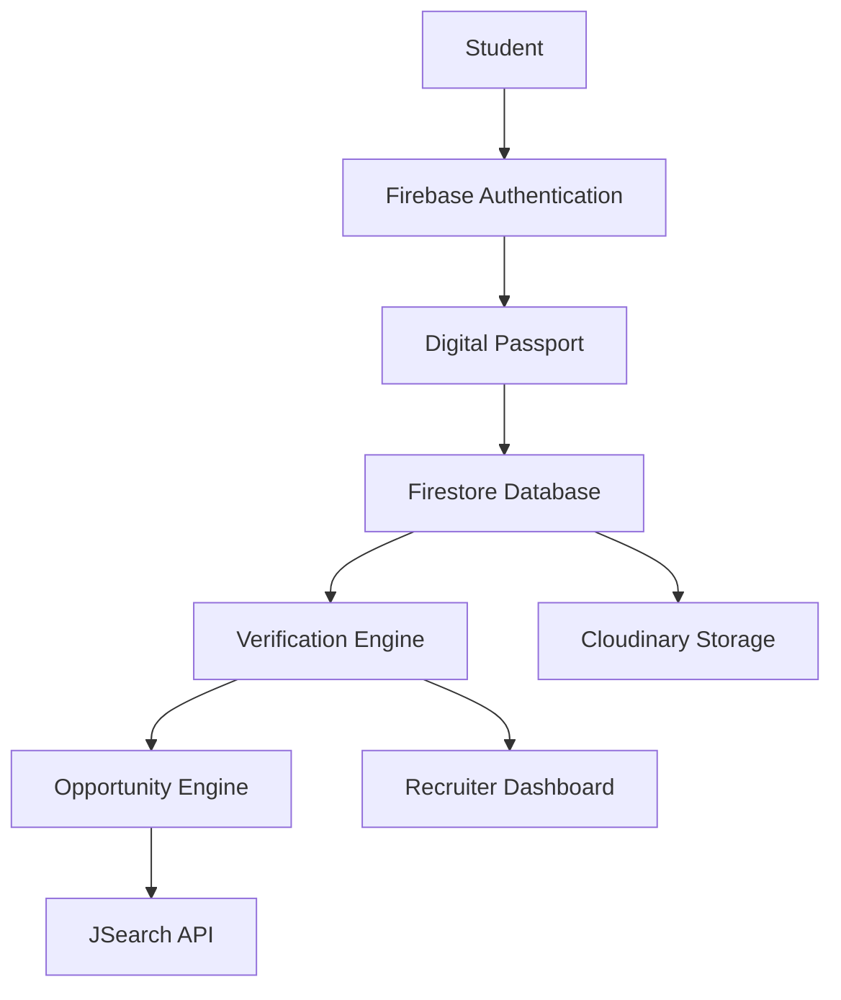

<p align="center">
  
</p>

<h1 align="center">AscendID</h1>

<h3 align="center">
Verified Potential • Trusted Opportunities
</h3>

<p align="center">
Building India's Talent Verification Infrastructure
</p>

<p align="center">


</p>

---

<p align="center">
  
</p>

---

## 🌍 The Vision

> UPI unified payments.
>
> DigiLocker unified documents.
>
> **AscendID unifies talent.**

AscendID is a next-generation verification infrastructure platform that combines academic identity, achievements, credentials, and opportunities into a unified digital passport.

Instead of repeatedly uploading documents and filling profiles across multiple portals, students create a single trusted identity layer.

Recruiters gain access to verified talent profiles, reducing hiring friction and improving trust.

---

## ⚡ Why AscendID?

<table>
<tr>
<td width="33%">

### 🎓 Students

* One Identity
* One Profile
* One Verification Layer
* Better Discoverability
* Reduced Application Fatigue

</td>

<td width="33%">

### 🏢 Recruiters

* Verified Candidates
* Reduced BGV Costs
* Faster Hiring
* Better Signal Quality
* Structured Profiles

</td>

<td width="33%">

### 🏛️ Institutions

* Trusted Credentials
* Centralized Records
* Verification Layer
* Better Transparency
* Digital Infrastructure

</td>
</tr>
</table>

---

## 🏗️ Platform Architecture



---

## 🚀 Core Features

| Feature                | Description                      |
| ---------------------- | -------------------------------- |
| 🔐 Authentication      | Google & Email Authentication    |
| 🎓 Academic Identity   | Academic Records Management      |
| 🪪 Digital Passport    | Unified Student Identity         |
| 📂 Proof Vault         | Secure Credential Storage        |
| 📊 Verification Index  | Verification & Readiness Layer   |
| 💼 Opportunity Engine  | Real Job & Internship Discovery  |
| 🏢 Recruiter Dashboard | Candidate Verification Interface |
| ☁️ Cloudinary Uploads  | Secure Document Upload System    |

---

## ⚙️ Technology Stack

<p align="center">


</p>

---

## 🔄 User Journey

```text
Google Login
      │
      ▼
Create Profile
      │
      ▼
Import Academic Identity
      │
      ▼
Upload Proofs
      │
      ▼
Generate Verification Index
      │
      ▼
Opportunity Discovery
      │
      ▼
Recruiter Verification
```

---

## 📸 Product Showcase

### Landing Page


### Student Dashboard


### Proof Vault


### Opportunity Engine


### Recruiter Dashboard


---

## 🏆 Null to One Hackathon 2026

**Team Name:** Bit Bandits

**Project:** AscendID

**Tagline:** Verified Potential. Trusted Opportunities.

Building the trust layer for India's next generation of talent.
